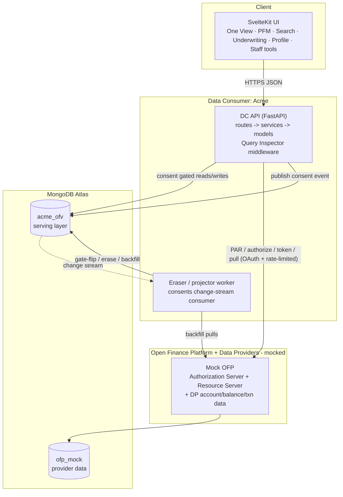
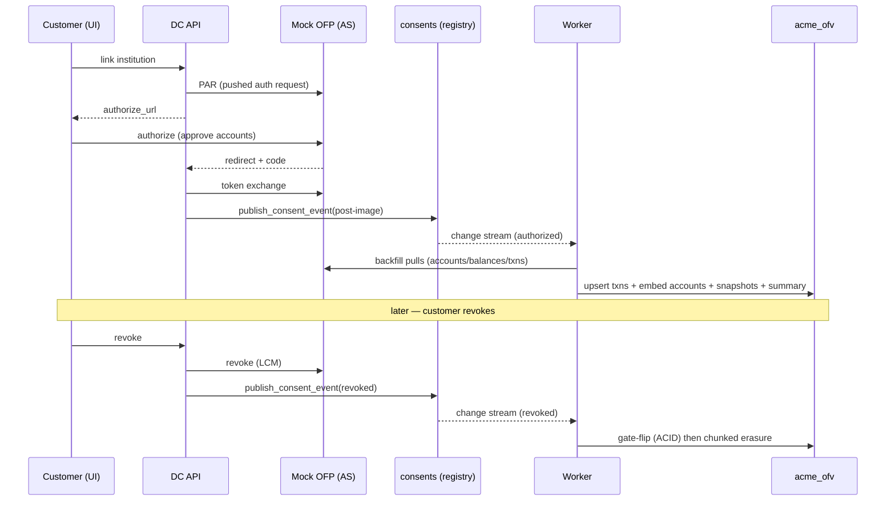
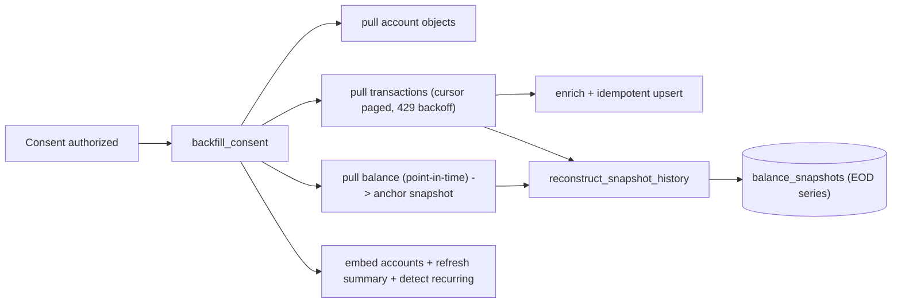
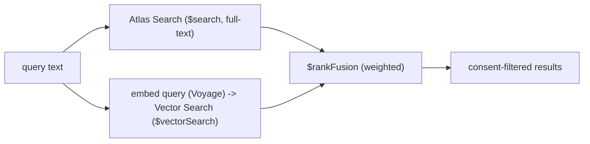
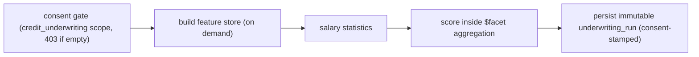
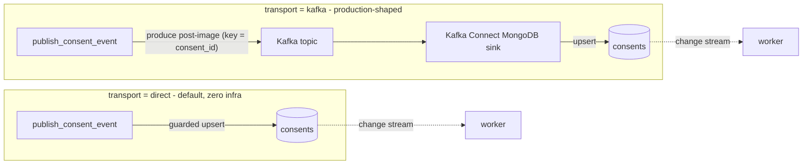
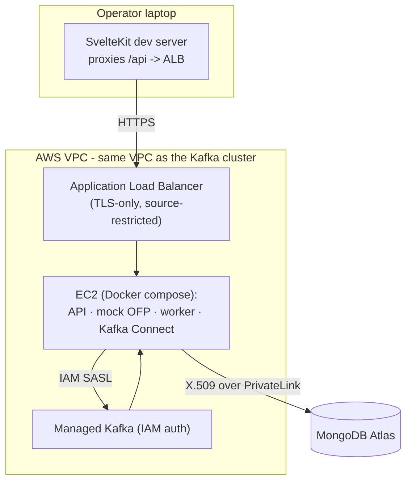

# Acme Open Finance — "One Financial View" (consumer side)

A proof-of-concept for a bank acting as a **Data Consumer (DC)** on a Open-Finance-style
Open Finance Platform (OFP): a customer consents to share data held at other banks
("Data Providers"), the bank ingests it under that consent, and presents a single
consolidated view plus credit underwriting — with consent enforced at every read
and a full audit/erasure trail.

This document describes the architecture. It is intentionally free of any
environment-specific identifiers and secrets.

---

## 1. What it does (capabilities)

- **One Financial View** — a consolidated picture of a customer's money across Acme
  and external banks, served from a single document read.
- **Personal Financial Management (PFM)** — spend-by-category, cashflow (money in /
  out), net worth trend, recurring detection, budgets, top merchants, commitments.
- **Transaction search** — hybrid full-text + semantic (vector) search over a
  customer's transactions, consent-scoped.
- **Credit underwriting** — a scorecard computed inside the database over only the
  consented account set, persisted as an immutable, consent-stamped inquiry.
- **Consent management** — link/authorize institutions, view/suspend/reactivate/
  revoke consents; revocation triggers gate-off plus physical erasure.
- **Operational tooling (staff)** — a live change-stream feed, a revocation "storm"
  load driver, an ingestion simulator, and a Query Inspector that surfaces the real
  MongoDB operations behind each screen.

---

## 2. Core principles

1. **Consent is enforced at the read path, not trusted from a stamp.** Live consent
   state lives in the consolidated profile; every read filters to the consented set.
2. **One ordered path per consent.** Every consent state change rides a single
   producer → registry → change-stream pipeline. Nothing writes consent state into
   the profile directly except the worker that consumes that stream.
3. **Single-read One View (Path A).** The consolidated profile embeds accounts,
   consent boxes, balances, summary, and recent transactions, so the headline screen
   is one document read with consent filtering applied in-pipeline.
4. **Lean rows at scale.** Transaction rows are slim; consent provenance is a single
   id on external rows only (recoverable by join), never a per-row status block.
5. **Reactive, decomposable underwriting.** Feature components are built on demand at
   loan inquiry and scored inside an aggregation; revocation needs no recompute — an
   account simply drops out of the scope filter.

---

## 3. System components



- **DC API** (`acme_ofv.api.app`) — composition root: lifespan (Mongo client),
  the Query Inspector ASGI middleware, and a versioned router. Thin controllers in
  `api/v1/routes/*` delegate to services in `services/*` (one responsibility each).
- **Mock OFP** (`acme_ofv.mock_ofp`) — stands in for the OFP Authorization Server +
  Resource Server and the Data Providers. Serves the OAuth/PAR endpoints and the
  account/balance/transaction objects, backed by `ofp_mock`.
- **Worker** (`acme_ofv.eraser.worker`) — the sole writer of consent state into the
  consolidated profile. Tails the consents change stream and reacts (see §6).
- **Frontend** (SvelteKit) — the customer app plus a "Acme staff view" (underwriting,
  scale ops, simulation) and a Query Inspector drawer.
- **MongoDB Atlas** — `acme_ofv` (DC serving layer) and `ofp_mock` (provider data),
  authenticated with X.509. Atlas Search + Vector Search power transaction search.

---

## 4. Data model (collections in `acme_ofv`)

| Collection | Role |
|---|---|
| `customer_profiles` | The One View document: embedded accounts (internal + external), per-account **consent boxes** (live state), `summary` (net position, institutions, counts), and a capped `recent_transactions` for the single-read screen. |
| `transactions` | Lean per-row ledger. `_id = dp_id::transaction_id` (idempotent upsert). Rich derived `enrichment` (category/subcategory, merchant, channel, amount bucket, temporal fields, tags). External rows carry a single `consent_id` provenance stamp. |
| `consents` | Consent registry. `_id = consent_id`, monotonic `_rcp_version`, `status`, `permissions`, `accounts`, `consent_purpose`, `expiration_datetime`. |
| `balance_snapshots` | **Time series** of end-of-day balances per account, reconstructed from transactions at backfill (see §7). |
| `uw_features` | Per-account, decomposable underwriting components; built on demand at loan inquiry. |
| `underwriting_runs` | Immutable, consent-stamped inquiry records (scorecard + feature snapshot + governing consents + per-step operations). |
| `consent_audit_log`, `erasure_jobs` | Governance trail: gate-flips, physical erasure jobs with metrics. |
| `ofp_pull_ledger` | Per-pull stats (calls, 429s, latency, rows) for backfill + incremental sync. |
| `dc_tokens`, `dc_link_states`, `webhook_events`, `institutions` | Link-flow + token storage, webhook receipts, institution catalog. |
| `simulation_runs`, `ops_runs`, `stream_checkpoints` | Staff tooling: simulator + storm run history; change-stream resume tokens. |

Search indexes on `transactions`: an Atlas **Search** index (full-text) and an Atlas
**Vector Search** index (semantic embeddings).

---

## 5. Consent lifecycle (the governance spine)



- **Authorization** is the standard PAR → authorize → token handshake against the
  OFP. On success the consent **post-image** is published once.
- **`publish_consent_event`** is the single ordering authority per `consent_id`
  (monotonic `_rcp_version`). Two transports (§9): `direct` (in-process guarded
  upsert) and `kafka` (produce to a topic; a Kafka Connect sink applies the upsert).
  Downstream of the registry, behavior is identical.
- **Enforcement** is at read time: the One View pipeline `$filter`s accounts by their
  consent boxes (authorized + unexpired); underwriting resolves the
  `credit_underwriting` scope and refuses (HTTP 403) if it is empty.
- **Revocation** = an instant ACID **gate-flip** (reads exclude the accounts
  immediately) followed by **chunked physical erasure** — but only for accounts **not
  still covered by another authorized consent** (a set-difference rule). the Open Finance platform
  consents are immutable in scope, so a "change" is revoke + a brand-new consent.
- **Provenance**: external transaction rows carry `consent_id` (the lawful basis they
  were collected under) — recoverable by join, not duplicated per row.

---

## 6. The worker (consents change-stream consumer)

The only writer of consent boxes into `customer_profiles`. For each consent event:

- `authorized` → **backfill** (first time) or re-project consent boxes (reactivation).
- `suspended` / `expired` → **gate-flip** (ACID: box update + audit) — reads stop.
- `revoked` → gate-flip, then **chunked physical erasure** off the covering index,
  with per-batch metrics into `erasure_jobs`.

It also runs a live `uw_features` updater (per-insert bucket increments) and an expiry
sweeper (bookkeeping; enforcement is the `$gt` comparison in the gate). Change-stream
resume tokens are persisted so it is crash-resumable.

---

## 7. Ingestion + balance reconstruction



- **Rate-faithful pulls**: a per-Data-Provider token bucket (provider request/min
  limit), cursor pagination, and 429 backoff — modeling real OFP consumption.
- **Enrichment at write time**: category/subcategory, normalized merchant, channel,
  amount bucket, temporal fields (day/hour/weekend/month), discretionary flag, tags.
- **Balance reconstruction**: the OFP serves balances point-in-time only. Rather than
  synthesizing a trend, the end-of-day balance series is **reconstructed by walking
  the pulled transactions backward from the current-balance anchor** (inverting each
  signed delta). It runs once per consent's first backfill; depth is bounded by the
  pulled transaction window. Reconstruction is a *build* step on grant — it is **not**
  related to revocation (revocation deletes; see §5).
- **Incremental sync**: scheduled top-up pulls (from last-pulled minus an overlap
  window), idempotent.

---

## 8. Read/serving paths

- **One View (Path A)** — a single `customer_profiles` read, consent-filtering the
  embedded accounts and recent transactions in the aggregation. No second collection
  read for the headline.
- **PFM** — category/cashflow/net-worth/recurring/budgets/commitments aggregations,
  consent-scoped; cashflow + net-worth lean on the reconstructed `balance_snapshots`.
- **Transaction search** — hybrid:


  Embeddings are generated for a capped sample of customers (cost guard); both legs
  apply the consent filter as a hard constraint.

- **Underwriting** —


  Each run records a per-step **operations** list (latency + the MongoDB ops each step
  ran), surfaced in a progress popup.

---

## 9. Consent-event transport: `direct` and `kafka`

The producer (`publish_consent_event`) has two interchangeable transports; downstream
consumers are identical because both end with the same upsert into `consents`.



- **`direct`** — the in-process, `_rcp_version`-guarded upsert. The default; no
  external infrastructure required.
- **`kafka`** — the post-image is produced to a topic **keyed by `consent_id`** (so
  all events for one consent share a partition and Kafka preserves order), and a
  **Kafka Connect MongoDB sink** applies the upsert. The post-image is encoded as
  **Extended JSON** and the sink uses a string converter, so dates/decimals land as
  real BSON types — byte-faithful with the direct path. The change stream and the
  worker are unchanged.

Production upstream (not built): a CDC source over an RCP consent outbox table feeds
the same topic with a byte-identical envelope.

---

## 10. Deployment shape (AWS)

The whole backend can run direct-on-localhost (transport `direct`, no infra) or
deployed:



- The backend stack is containerized (one app image for API / mock / worker; a Kafka
  Connect image) and runs on an EC2 **inside the Kafka cluster's VPC**, behind an
  **Application Load Balancer**. Only the frontend stays local, pointed at the ALB
  through the dev proxy.
- **The ALB is TLS-only and source-restricted.** HTTPS listeners terminate TLS
  (ACM cert) and `:80` 301-redirects to `:443`; the security group admits only an
  explicit allow-list of source CIDRs (never `0.0.0.0/0`). The app additionally
  supports an optional API-key gate on every route except the health check. The
  local dev proxy reaches the ALB server-side, so the browser stays on localhost.
- **Atlas connectivity is over PrivateLink with X.509** (the app via the driver's PEM;
  Kafka Connect via a JVM PKCS12 keystore). Kafka auth is IAM via the instance role.
- Secrets (Atlas URI, X.509 cert, embedding key, API key) are delivered from a secrets
  manager at boot — never baked into images or committed.

> Live, environment-specific identifiers (DNS names, instance/account/cluster ids) and
> the step-by-step deploy runbook are kept in the internal notes, not in this public
> document.

---

## 11. Cross-cutting: the Query Inspector

A pure-ASGI middleware captures every MongoDB aggregation run during a request
(collection, pipeline, duration, result count + a truncated preview) into a
per-request context log, and injects it into the JSON response as `_queries`. The UI
strips that field and renders it in a drawer — so any screen can show the exact
`db.collection.aggregate(...)` calls and sample results behind it. The underwriting
console additionally embeds the per-step operations directly in each run for a
collapsible drill-down.

---

## 12. Repository layout

```
acme-ofv/
  backend/acme_ofv/
    api/            # FastAPI composition root + v1 routes (thin controllers)
    services/       # business logic (one_view, pfm, search, underwriting, consent, ops, simulation)
    consent/        # gate (read enforcement) + producer (single ordered path)
    ingestion/      # backfill, incremental sync, enrichment, snapshots, recurring, features
    streaming/      # MSK producer + topic admin (kafka transport)
    eraser/         # change-stream worker (gate-flip / erase / backfill / updaters)
    mock_ofp/       # Open Finance Platform + Data Provider mock
    infra/          # collection + index + search-index setup
    seed/           # synthetic data generation + link-all driver
  frontend/         # SvelteKit UI
  ops/              # run scripts, docker-compose, Kafka Connect assets
  deploy/terraform/ # AWS estate (reuses VPC/Kafka/PrivateLink; creates ALB/EC2/IAM)
```
